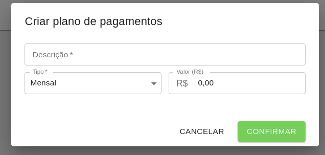

# Planos

Através do cadastro de planos, é possível definir os tipos de cobrança disponíveis para as matrículas dos Alunos.

Ao cadastrar um novo plano, através do botão "Criar Plano", é possível definir uma descrição para o plano, o tipo de cobrança (Mensal, Trimestral, Semestral ou Anual) e o valor correspondente aquele plano.

Além disso, é possível alterar um plano clicando sobre ele, ou então excluí-lo, clicando no ícone de lixeira.

Caso o plano já esteja relacionado a alguma matrícula, o mesmo não poderá ser excluído.