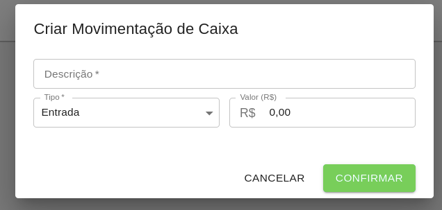

# Fluxo de Caixa

No Fluxo de Caixa, é possível controlar todas as movimentações de entrada e saída de valores do Caixa.

Para registro de uma nova movimentação, basta selecionar a opção Criar Movimentação de Caixa e informar uma descrição, o tipo (Entrada ou Saída) e o valor em reais.

Após o cadastro, é possível alterar um fluxo de caixa clicando sobre ele, ou então excluí-lo, clicando no ícone de lixeira.

Automaticamente, o valor contido em caixa é atualizado com base nas movimentações.

Também, ao registrar um Pagamento de Aluno, o mesmo registra uma movimentação automática de entrada.