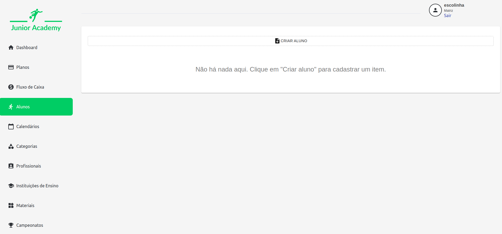
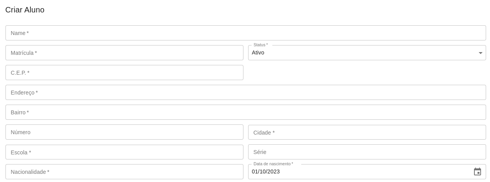
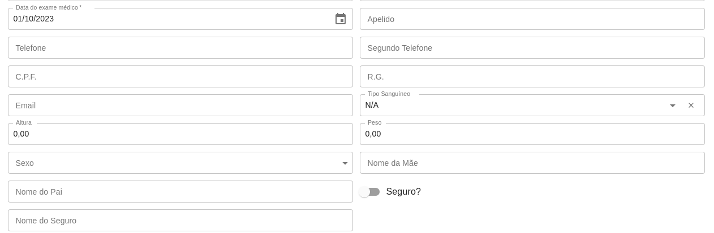
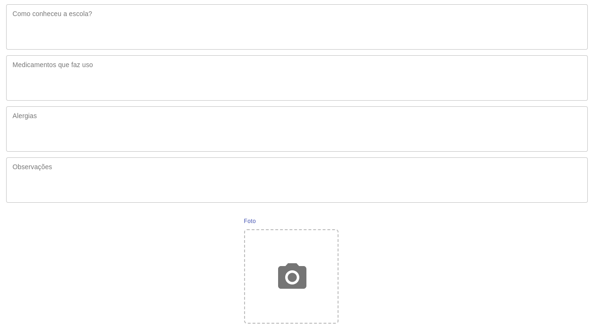
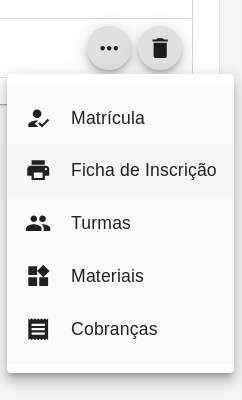
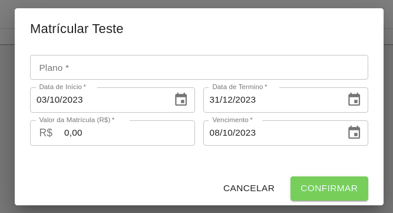

# Alunos

No cadastro de Alunos, são identificados os atletas que estão cadastrados no sistema. Para cadastrar um novo aluno, clique no botão "Criar Aluno" e preencha os campos com as informações do atleta.

As informações a serem preenchidas sobre o aluno são:
* Nome: Nome do aluno
* Matrícula: Número interno de registro do aluno
* Status: Indica se o aluno está Ativo ou Inativo
* CEP: Código de Endereçamento Postal
* Endereço: Nome da rua, avenida, etc.
* Número: Número da casa, apartamento, etc.
* Bairro: Nome do bairro
* Cidade: Nome da cidade
* Escola: Instituição de ensino onde o aluno está matriculado. Relacionado com o cadastro de [Instituições](../Institui%C3%A7%C3%A3o/Institui%C3%A7%C3%A3o.md)
* Série: Idade escolado do aluno (ex.: Terceira Série)
* Nacionalidade: Nacionalidade do aluno
* Data de Nascimento: Data de nascimento do aluno
* Apelido: Apelido do aluno
* Telefone: Telefone principal do aluno
* Segundo Telefone: Telefone secundário do aluno
* C.P.F.: Cadastro de Pessoa Física do aluno
* R.G.: Registro Geral do aluno
* E-mail: E-mail do aluno
* Tipo Sanguíneo: Tipo sanguíneo do aluno
* Altura: Altura do aluno
* Peso: Peso do aluno
* Sexo: Sexo do aluno
* Nome do Pai: Nome do pai do aluno
* Nome da Mãe: Nome da mãe do aluno
* Seguro?: Indica se o aluno possui seguro de vida
* Nome do Seguro: Nome da seguradora do seguro de vida do aluno
* Como conheceu a escola?: Como o aluno conheceu a escolinha
* Medicamentos que faz uso: Medicamentos que o aluno faz uso
* Alergias: Alergias do aluno
* Observações: Observações sobre o aluno
* Foto: Foto do aluno

Também, é possível definir os responsáveis pelo aluno, informando Nome, C.P.F., R.G., Telefone principal e segundário e se é o principal responsável pelo aluno.

Após o cadastro, é possível alterar um aluno clicando sobre ele, ou então excluí-lo, clicando no ícone de lixeira.

Com isso, ficarão disponíveis as seguintes opções para o aluno:

* Matrícula: Realiza a matrícula do aluno
* Ficha de Inscrição: Imprime as informações de ficha de inscrição
* Turmas: Lista as turmas onde o aluno está inserido
* Materiais: Lista os materiais de aquisição do aluno
* Cobranças: Lista os carnês de cobrança do aluno
  
Ao selecionar a matrícula, é necessário informar o [Plano](../Planos/Planos) de Pagamento, a Data de Início e Término de matrícula, o valor da matrícula e o vencimento. Após isso, é possível realizar a matrícula do aluno.

São geradas automaticamente as cobranças na opção de Cobranças, com o valor da matrícula e o valor da mensalidade, de acordo com o plano de pagamento selecionado.