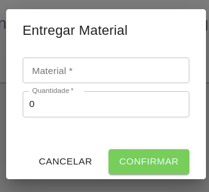

# Materiais do Aluno

Ao selecionar a opção Materiais, é possível registrar o material e a quantidade entrega para um determinado [aluno](../Alunos).

Para isso, basta informar o [Material](../Materiais/Materiais) e a quantidade através do botão Entregar Material.

Ao realizar o registro, uma cobrança é gerada automaticamente com o valor correspondente ao material e a quantidade informada.