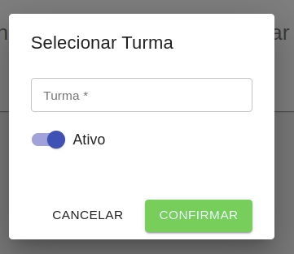

# Turmas do Aluno

Ao selecionar a opção Turmas, é possível visualizar a listagem de turmas onde o [aluno](./Alunos) está inserido.

Para criar uma turma, basta informar a Turma conforme a idade do aluno e se está ativo ou não na turma.

Após o cadastro, é possível alterar uma turma clicando sobre ela, ou então excluí-la, clicando no ícone de lixeira.