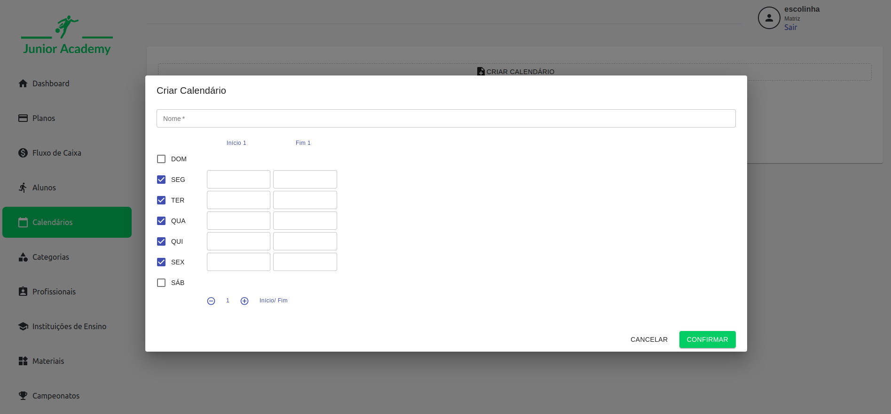
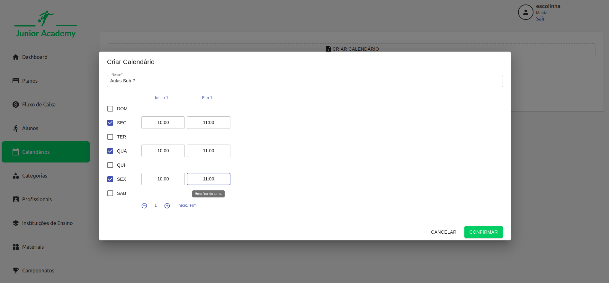

# Calendário

O cadastro de calendário tem como objetivo definir os horários dos treinos disponíveis para cada categoria.

Através do cadastro, é possível definir os dias da semana em que ocorrerão os treinos, bem como até 4 intervalos diferentes de horários para cada dia.

Para cadastrar um novo calendário, basta clicar no botão "Criar Calendário" e informar uma descrição para o mesmo. Após, selecionar os dias e horários disponíveis para cada dia.

Após o cadastro, é possível alterar um calendário clicando sobre ele, ou então excluí-lo, clicando no ícone de lixeira.

Com o calendário cadastrado, é possível definir as turmas para cada categoria, através do cadastro de [Turmas](../Categorias/Turma).