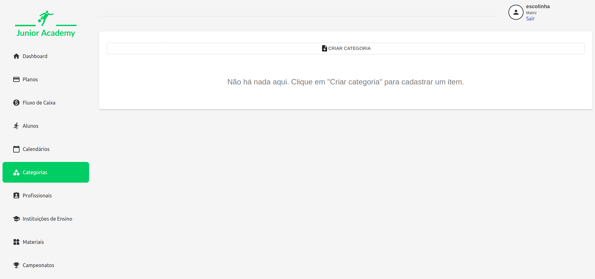
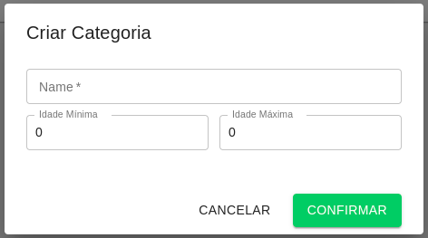
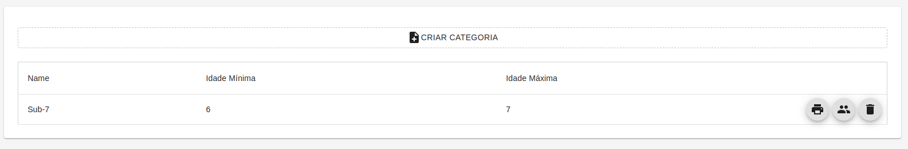

# Categoria

No cadastro de categorais, são definidas as categorias por idade para cada aluno.

São informadas as informação de nome da categoria, idade mínima e idade máxima.

Após o cadastro, é possível alterar uma categoria clicando sobre ela, ou então excluí-la, clicando no ícone de lixeira.

Também, com o cadastro realizado são disponibilizadas a impressão de listagem dos Alunos na Categoria, no botão de Impressão, e a criação de Turmas para a categoria, no botão [Turma](./Turma).

