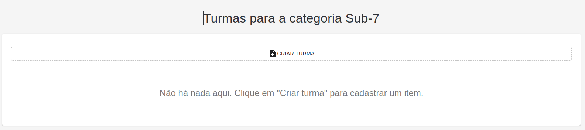
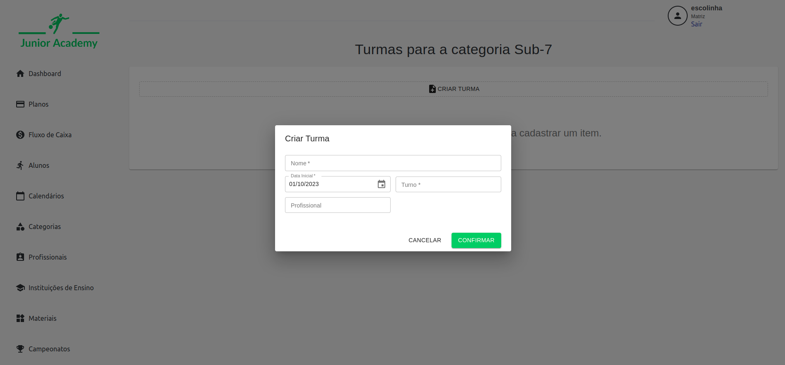

# Turma

Ao acessar a opção de turma, são exibidas as informações de turmas relacionadas com a [Categoria](./Categoria) selecionada.

Na opção de criação da Turma, é possível definir o nome da turma, o calendário e o profissional responsável por esta turma.

Após o cadastro, é possível alterar uma turma clicando sobre ela, ou então excluí-la, clicando no ícone de lixeira.