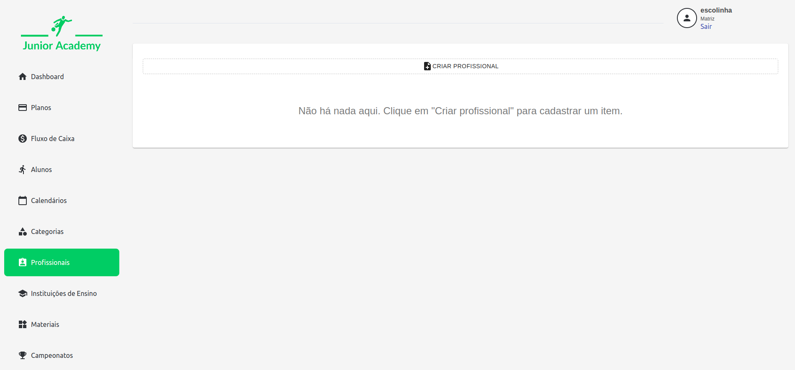
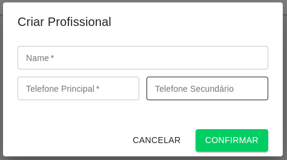

# Profissionais

No cadastro de profissionais, são definidos os profissionais que atuam na escolinha.

São informadas as informações de nome, telefone principal e secundário.

Após o cadastro, é possível alterar um profissional clicando sobre ele, ou então excluí-lo, clicando no ícone de lixeira.

O profissional cadastrado é disponibilizado para seleção no cadastro de [Turmas](../Categorias/Turma).
