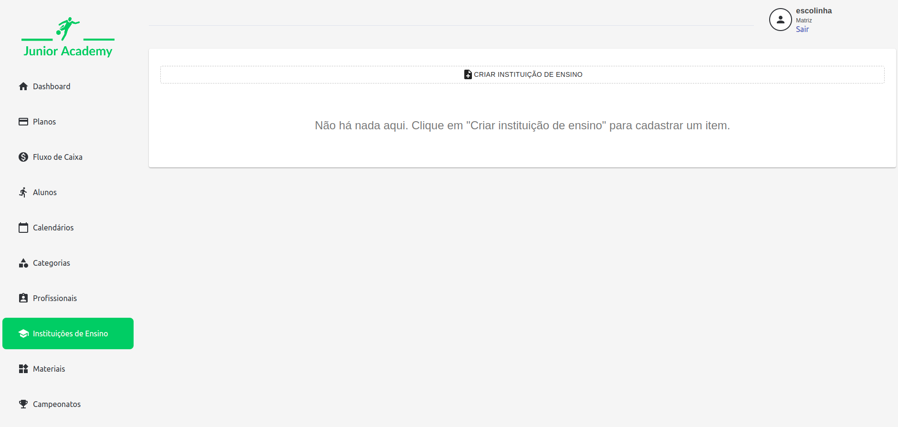
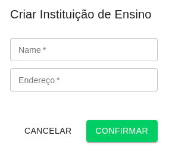

# Instituição

No cadastro de instituição, são informadas as escolas onde os alunos estão regularmente matriculados no ensino fundamental e médio.

São informadas as informações de nome e endereço da instituição.

Após o cadastro, é possível alterar uma instituição clicando sobre ela, ou então excluí-la, clicando no ícone de lixeira.