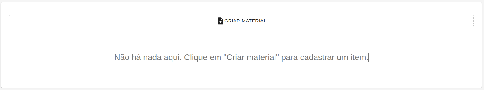
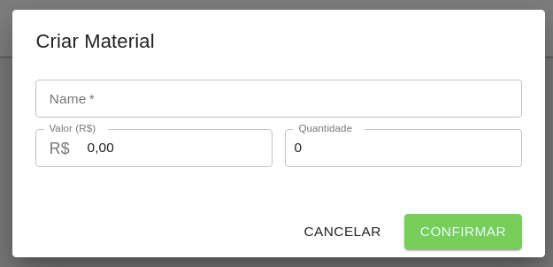
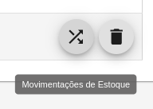
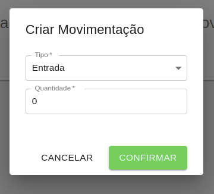

# Materiais

No cadastro de materiais, são definidos os materiais fornecidos e ofertados pela escolinha.

Para criar um material, é necessário informar o nome, o valor em reais e a quantidade atual em estoque.

Após o cadastro, é possível alterar um material clicando sobre ele, ou então excluí-lo, clicando no ícone de lixeira.

Também, é possível controlar as movimentações dos materiais, clicando no ícone de movimentação.

Com isso, é possível realizar movimentações de entrada e saída dos materiais do estoque da escolinha.

O material criado pode ser registrado como um material adquirido pelo aluno no cadastro de [Materiais do Aluno](../Alunos/Materiais).