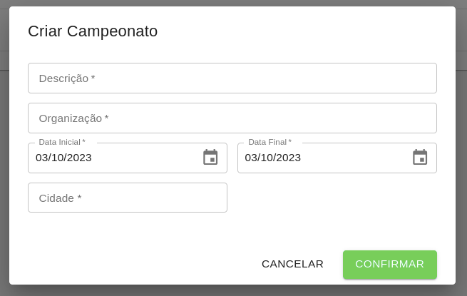
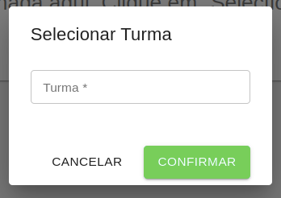
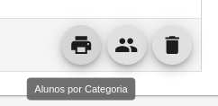

# Campeonatos

O cadastro de campeonatos permite gerenciar os campeonatos em que a escolinha está participando.

Para criar um campeonato, é necessário informar a Descrição, a entidade de organização, data início e fim bem como a Cidade em que ocorrerá.

Após o cadastro, é possível alterar um campeonato clicando sobre ele, ou então excluí-lo, clicando no ícone de lixeira.

Também, através da opção Turmas, é possível registrar as turmas que irão para aquele campeonato.

Por fim, através da opção de Impressão é possível imprimir a listagem dos alunos de cada turma.

