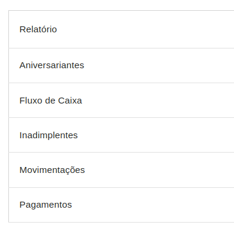

# Relatórios

Na opção de relatórios, são possíveis estrarir informações de alunos, turmas, cobranças e pagamentos.

* Aniversariantes: Lista de alunos que fazem aniversário no mês selecionado.
* Fluxo de Caixa: Lista de cobranças e pagamentos realizados no período selecionado.
* Inadimplentes: Lista de alunos que estão com cobranças em aberto.
* Movimentações: Lista de materiais movimentados no período selecionado.
* Pagamentos: Lista de pagamentos realizados no período selecionado.

Para impressão, basta clicar sobre eles que será apresentada uma tela solicitando as informações de filtro de impressão.

