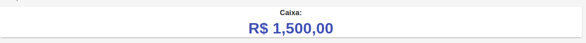
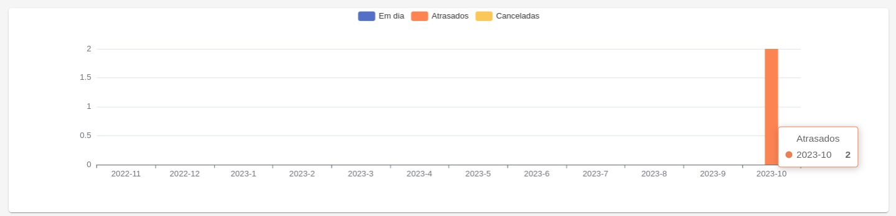
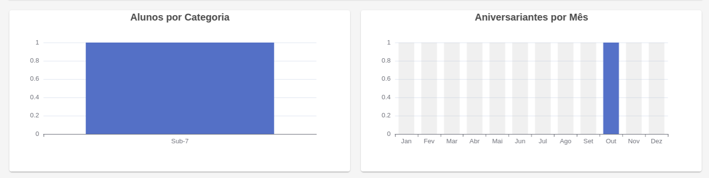
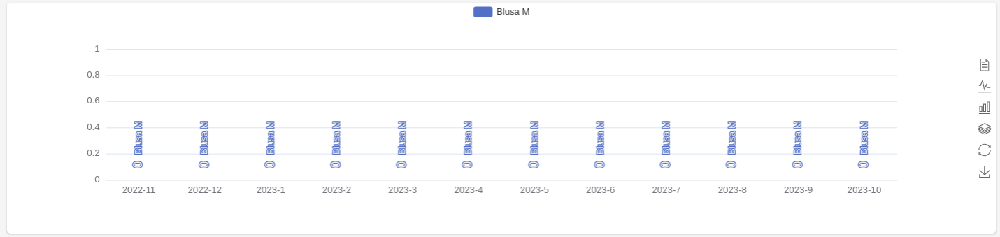

# Dashboard

Na Home do sistema, é possível visualizar um resumo das informações mais importantes do sistema.

A primeira informação é o valor atual em caixa:

Após, temos o total de faturas em aberto:

Os alunos ativos em cada categoria e os aniversariantes do mês:

E, por fim, a quantidade de movimentações no estoque dos últimos 12 meses:

